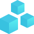

# [AraCon](https://aracon.one/) - The Aragon Conference
[](https://AraCon.one/)

[The Aragon Conference](https://aracon.one/) will bring together people who embody and wish to shape the Aragon community. Those who are building and supporting the pseudonymous, secure, trustless future — the decentralized web.

AraCon will be hosting 500 attendees that wish to join us for insights into this paradigm shift.

By concentrating on a few themes, we can provide much deeper and thorough presentations on these topics.



Discover the emergence of new types of organizations with DAOs.


Grasp what makes decentralized governance so relevant to Web3.0.


Understand how Ethereum is making the decentralized web a reality.


See how Aragon is bringing freedom for all with these revolutionary advancements.

**We invite everyone to come be a part of this growing movement and learn more about how we can build this future together!**

## **[https://AraCon.one/](https://AraCon.one/)**

### [FAQ](https://aracon.one/faq)

#### WHAT IS ARACON?
AraCon is the flagship event of the Aragon Project. It is organised by the Aragon Association for the Aragon community and anyone interested in the decentralized web, governance, DAOs, and digital jurisdictions.

#### WHEN AND WHERE IS ARACON HAPPENING?
AraCon is taking place on 29th-30th of January 2019, at Bolle Festsäle in Berlin, Germany.

#### WHO WILL BE SPEAKING AT ARACON?

There will be over 30 speakers, you can view all the confirmed speakers [here](https://aracon.one/speakers). We'll be adding more speakers to the list soon. Speakers come from a variety of backgrounds and projects/companies like [0x](https://0xproject.com/), [ConsenSys](https://consensys.net/), [Democracy Earth](https://www.democracy.earth/), [district0x](https://district0x.io/), [Giveth](https://giveth.io/), [Gnosis](https://gnosis.pm/) & [Parity](https://www.parity.io/) among others.

#### HOW DO I REGISTER FOR ARACON?

To learn more about registration process and fees, check out the [Registration page](https://aracon.one/registration).

### [Find out more](https://aracon.one/faq)

## Website Build Setup

``` bash
# install dependencies
$ npm install # Or yarn install

# serve with hot reload at localhost:3000
$ npm start
```
